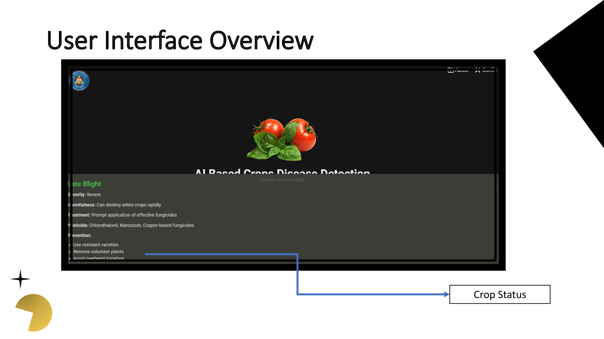

# AI-Driven Crop Disease Detection System

## Overview
This project presents an AI-driven crop disease detection system addressing challenges in modern agriculture. Utilizing deep learning, IoT, and user-centric design, it detects tomato plant diseases through leaf image analysis.

## Features
- **Deep Learning-Based Detection**: A TensorFlow/Keras Convolutional Neural Network (CNN) classifies leaves as healthy or diseased with high accuracy.
- **FastAPI Integration**: Ensures seamless communication with web and mobile platforms.
- **IoT Hardware Implementation**: The ESP32-CAM module captures images, providing a cost-effective solution.
- **Dual-Platform Frontend**:
  - **Web Application**: Responsive interface for real-time diagnostics.
  - **Flutter Mobile App**: Mobile-friendly solution with live streaming and image uploads.
- **Scalable & Efficient**: Designed to be resource-efficient and scalable, especially for precision farming in regions like Nepal.

## System Architecture
```
[ESP32-CAM] ---> [FastAPI Server (CNN Model)] ---> [Web App / Flutter App]
```

## Technology Stack
- **Machine Learning**: TensorFlow, Keras, OpenCV
- **Backend**: FastAPI (Python)
- **Frontend**:
  - Web: HTML, CSS, JavaScript 
  - Mobile: Flutter (Dart)
- **Hardware**: ESP32-CAM, USB-to-TTL converter


## Screenshots & Demo
### Web Application Interface



### Mobile App Interface


### Hardware Setup


## Contribution
Contributions are welcome! Feel free to submit a pull request or raise an issue.

## License
This project is licensed under [Your Chosen License].

